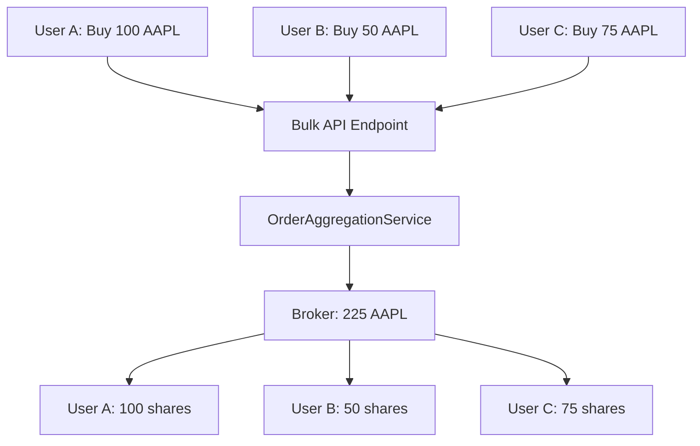
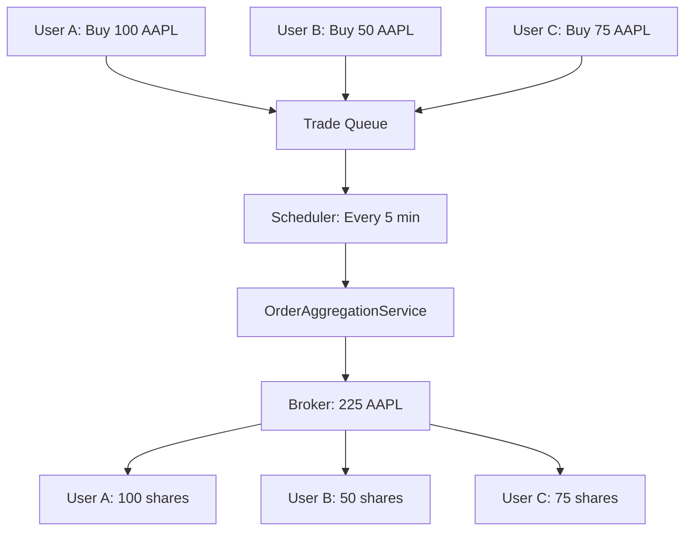

# Order Aggregation Architecture

## 🎯 **Different Aggregation Layers Explained**

The system now supports **three levels** of order aggregation, each with different timing and aggregation strategies:

### **1. IMMEDIATE AGGREGATION** (Currently Implemented)
```
User Requests → API → Immediate Aggregation → Broker → Distribution
     ↓             ↓           ↓                 ↓          ↓
   Multiple     Bulk API    Group by        Single API   Individual
   users call   endpoint    symbol+side     calls per    transactions
   at once                                  symbol       back to users
```

**Timing**: Immediate execution when bulk API is called
**Aggregation**: Groups orders by (symbol, side, broker_type)
**Location**: `OrderAggregationService.aggregate_and_execute_orders()`
**Use Case**: When you have multiple users ready to trade now

### **2. TIME-BASED QUEUED AGGREGATION** (New Implementation)
```
User Requests → Queue → Wait for Batch Window → Aggregation → Broker → Distribution
     ↓            ↓           ↓                    ↓           ↓          ↓
   Individual   Trade      Every 5 minutes       Group by    Single     Individual
   orders       Queue      batch window          symbol      API calls  transactions
   queued                                                                back to users
```

**Timing**: Orders queued, executed every 5 minutes
**Aggregation**: Groups orders from queue by batch window + symbol + side
**Location**: `TradeQueueService.process_queued_orders()`
**Use Case**: Continuous order flow with optimal aggregation

### **3. SMART HYBRID AGGREGATION** (Conceptual Extension)
```
High Priority → Immediate Aggregation
Normal Orders → 5-minute Queue
Large Orders  → Special handling
Market Close  → Rush processing
```

**Timing**: Dynamic based on order characteristics
**Aggregation**: Multiple strategies based on context
**Use Case**: Production system with various order types

---

## 🔄 **Current vs New Aggregation Flow**

### **BEFORE (Current System)**


**Benefits**: ✅ Aggregates orders ✅ Reduces API calls
**Limitations**: ❌ Requires manual bulk submission ❌ No continuous aggregation

### **AFTER (New Queue System)**


**Benefits**: ✅ Automatic aggregation ✅ Continuous processing ✅ Better efficiency
**Trade-off**: ⏱️ Orders execute in batches (up to 5-minute delay)

---

## 📊 **Aggregation Layers Comparison**

| Layer | Timing | Trigger | Aggregation Window | Use Case |
|-------|--------|---------|-------------------|----------|
| **Immediate** | Real-time | Manual bulk API call | Single request | Multiple users trading simultaneously |
| **Queued** | 5-minute batches | Automatic scheduler | Time window | Continuous order flow |
| **Hybrid** | Dynamic | Context-aware | Variable | Production system |

---

## 🏗️ **Implementation Details**

### **Layer 1: Immediate Aggregation**
```python
# Location: OrderAggregationService
async def aggregate_and_execute_orders(
    db: AsyncSession,
    orders: List[SmallcaseExecutionOrder],
    stock_lookup: Dict[uuid.UUID, Dict[str, Any]],
    investments_by_user: Dict[uuid.UUID, UserSmallcaseInvestment]
) -> Dict[str, Any]:
    # Groups orders by (symbol, side, broker_type)
    # Executes immediately with broker
    # Distributes results back to users
```

### **Layer 2: Queued Aggregation**
```python
# Location: TradeQueueService
async def queue_order(
    db: AsyncSession,
    execution_order: SmallcaseExecutionOrder,
    priority: str = "normal",
    execution_window: Optional[datetime] = None
) -> str:
    # Queues order for batch execution
    # Returns queue ID for tracking

async def process_queued_orders(db: AsyncSession) -> Dict[str, Any]:
    # Processes all orders ready for execution
    # Groups by execution window + symbol + side
    # Uses OrderAggregationService for actual execution
```

### **Background Scheduler**
```python
# Location: TradeScheduler
class TradeScheduler:
    def __init__(self):
        self.process_interval_seconds = 60  # Check every minute

    async def _scheduler_loop(self):
        # Continuously processes queued orders
        # Runs every minute, executes orders ready for batch window
```

---

## 🎯 **Which Layer Aggregates What?**

### **OrderAggregationService** (Layer 1 & 2)
- **What**: Groups orders by (symbol, side, broker_type)
- **When**: Called by both immediate and queued systems
- **How**: Creates `AggregatedOrder` objects, executes with master broker account

### **TradeQueueService** (Layer 2)
- **What**: Manages order queuing and batch timing
- **When**: Orders submitted individually, processed on schedule
- **How**: Stores orders in database, groups by execution window

### **TradeScheduler** (Layer 2)
- **What**: Triggers automatic processing of queued orders
- **When**: Runs continuously in background
- **How**: Checks every minute for orders ready to execute

---

## 🚀 **API Usage Examples**

### **Immediate Aggregation (Existing)**
```bash
# Submit bulk orders for immediate execution
curl -X POST /smallcases/bulk/rebalance \
  -d '[
    {"user_id":"user1","smallcase_id":"sc1","suggestions":[...]},
    {"user_id":"user2","smallcase_id":"sc1","suggestions":[...]}
  ]'
```

### **Queued Aggregation (New)**
```bash
# Queue individual order (executes in next batch window)
curl -X POST /trade-queue/queue/order \
  -d '{
    "smallcase_id":"sc1",
    "suggestions":[{"symbol":"AAPL","action":"buy","weight_change":5.0}],
    "priority":"normal"
  }'

# Check queue status
curl -X GET /trade-queue/queue/status

# Get aggregation preview (see how orders will be grouped)
curl -X GET /trade-queue/queue/aggregation-preview

# Manually trigger batch processing (for testing)
curl -X POST /trade-queue/queue/process
```

---

## 💡 **Benefits of Each Layer**

### **Immediate Aggregation**
- ✅ **Real-time execution** when multiple users trade simultaneously
- ✅ **Manual control** over when aggregation happens
- ✅ **Simple implementation** and testing

### **Queued Aggregation**
- ✅ **Automatic processing** without manual intervention
- ✅ **Better aggregation efficiency** with larger batch windows
- ✅ **Reduced market impact** with scheduled execution
- ✅ **Cost optimization** through maximum order consolidation
- ✅ **Scalable** for high-volume trading platforms

### **Hybrid Approach** (Future)
- ✅ **Best of both worlds** - immediate for urgent, queued for normal
- ✅ **Dynamic optimization** based on order characteristics
- ✅ **Market condition awareness** (e.g., rush processing near market close)

---

## 🎯 **Summary**

**Current Implementation**: ✅ Layer 1 (Immediate) + ✅ Layer 2 (Queued)

**Trade aggregation happens at**:
1. **OrderAggregationService**: Groups orders by symbol and executes with broker
2. **TradeQueueService**: Manages time-based batching and queuing
3. **TradeScheduler**: Automatically triggers batch processing every 5 minutes

**Result**: Users can now submit individual orders that automatically get aggregated and executed in efficient batches, reducing broker API calls and transaction costs while maintaining individual accountability.

The system provides both **immediate aggregation** (for bulk requests) and **queued aggregation** (for continuous order flow), giving maximum flexibility for different trading scenarios!