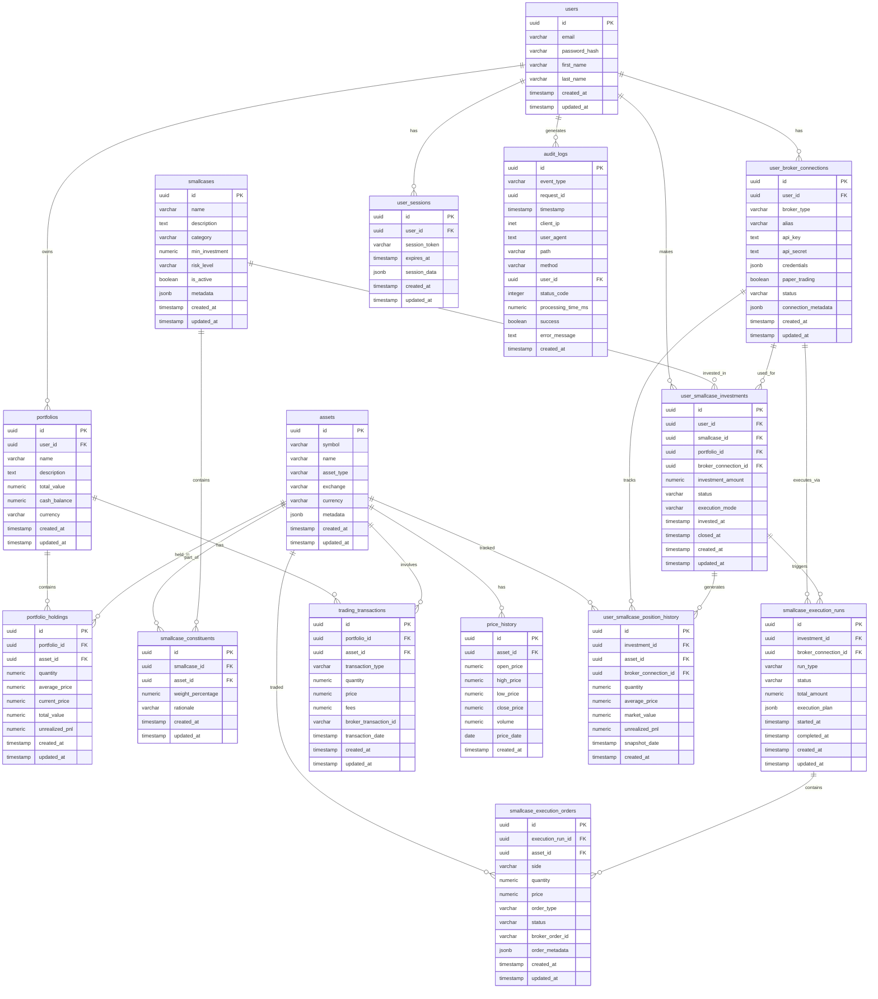

# Database Schema - Entity Relationship Diagram

This document contains the Entity Relationship Diagram for the Saras Trading Platform database schema.

## Overview

The database schema supports a multi-broker trading platform with the following key components:

- **User Management**: Authentication, sessions, and audit logging
- **Broker Integration**: Multi-broker connections with proper alias handling
- **Portfolio Management**: User portfolios, holdings, and transactions
- **Smallcase System**: Investment baskets, constituents, and user investments
- **Trade Execution**: Execution runs and orders through broker APIs
- **Market Data**: Asset information and price history
- **Position Tracking**: Historical position snapshots

## Entity Relationship Diagram

## Key Tables Description

### Core User Tables
- **users**: User account information and authentication
- **user_sessions**: JWT session management
- **audit_logs**: Security and request audit trail

### Broker Integration
- **user_broker_connections**: Multi-broker connections with unique aliases per user
  - Supports Alpaca, Zerodha, and other brokers
  - Each connection has a unique alias (e.g., "alpaca_primary")
  - Stores encrypted API keys and broker-specific metadata

### Portfolio Management
- **portfolios**: User portfolios containing multiple assets
- **portfolio_holdings**: Current positions in each portfolio
- **trading_transactions**: Historical trade records

### Smallcase System
- **smallcases**: Investment basket definitions
- **smallcase_constituents**: Assets and weights within each smallcase
- **user_smallcase_investments**: User investments in smallcases
- **smallcase_execution_runs**: Trade execution batches
- **smallcase_execution_orders**: Individual orders within execution runs

### Market Data
- **assets**: Asset master data (stocks, ETFs, etc.)
- **price_history**: Historical OHLCV data
- **user_smallcase_position_history**: Position snapshots over time

## Recent Schema Fixes

The following schema issues were recently resolved:

1. **Missing `updated_at` column** in `portfolio_holdings` table - Fixed via migration
2. **Column name mismatches** in broker selection service:
   - `broker_name` → `broker_type`
   - `is_active` → `status = 'active'`
   - `account_status` → `paper_trading`
3. **Missing `alias` field** in broker connection creation - Added with auto-generated values

## Database Migrations

Database migrations are stored in `/database/migrations/` and should be run in sequential order. The latest migration addresses the `portfolio_holdings.updated_at` column issue.